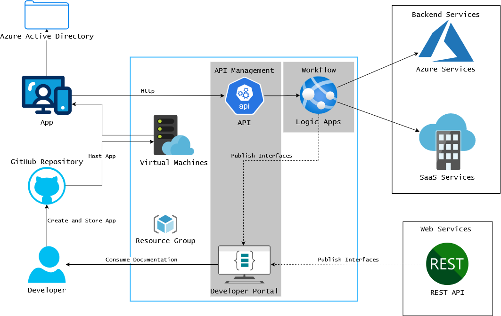

# HRIS - Human Resource Information System

Human Resource Information System (HRIS) is a software application designed to help organizations manage and automate various human resource functions. This system typically includes features such as employee management, attendance tracking, absence requests, and document handling.
</br></br>
## Contributor
- **Andreagazy Iza Amerianto** as *Project Manager & System Analyst*
- **Armand Maulana Andika Putra** as *UI/UX Designer*
- **Farid Fitriansah Alfarizi** as *Frontend Developer*
- **Muhammad Bagus Indrawan** as *Quality Assurance & Cloud Engineer*
- **Ricky Putra Pratama Tedjo** as *Backend Developer*
</br></br>
## Tech Stack

### Project Management


### UI/UX

### Frontend


### Backend


### Quality Assurance


### Cloud Computing


</br>

```
HRIS/
├── .github/
│   └── workflows/        # CI/CD workflows
├── apps/
│   ├── frontend/         # Next.js application
│   └── backend/          # Nest.js application
├── cypress/
│   └── e2e/              # End to end testing script
├── docker/
|   ├── frontend/         # Dockerfile for frontend
|   └── backend/          # Dockerfile for backend
└── prisma/
    ├── migrations/       # Database migrations
    └── schema.prisma     # Database schema
    └── seeder.ts         # Database seeder
```

</br>
## Cloud Architecture



</br></br>
## Setup

### Install node modules

```
npm install
```

### Generate database from existing migrations

```
 npx prisma generate
```

Then,

```
npx prisma migrate deploy
```

### Create a .env file

You could create one by duplicating the `.env.example` file in root and renaming it to `.env`. Then configure the `PORT` and the PostgreSQL url in `DATABASE_URL` based on your Postgres configuration.

### To run the backend

```
npm run start:backend
```

### To run the frontend

```
npm run start:frontend
```

More commands can be found on the `scripts` properties in `package.json` file in root.
